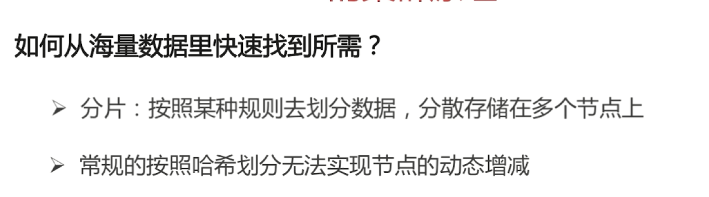

[toc]

# Java面试

## 1. Redis

### Redis简介


### Redis常用数据类型


### 从海量数据查询某一固定前缀的key

1、留意细节

​		摸清数据规模，问清楚边界


**批量生成Redis测试数据**

```
1.Linux Bash 执行
	for((i=1;i<=20000000;i++));
		do echo "set k$i V$i" >> /tmp/redisTest.txt
	生成两千万条Redis批量设置kv的语句写入文件
2.用vim去掉行尾的^M符号，如下：
	vim /tmp/redisTest.txt
	:set fileformat=dos # 设置文件的格式，通过这句话去掉每行结尾的^M符号
3.通过Redis提供的管道--pipe形式去跑Redis，传入文件指令批量灌数据，需要十分钟左右
cat /tmp/redisTest.txt | ../redis/src/redis-cli -h ip -p --pipe
```


**存到hashset里面达到去重的效果**


### 通过Redis实现分布式锁


 

<u>**缺点：原子性得不到满足**</u>


### 如何使用Redis做异步队列


**发布订阅模式**


### Redis如何做持久化

**RDB快照**


**AOF默认关闭**


### 使用Pipeline的好处


### Redis的同步机制


**slave负责读，master负责写**


### Redis的集群原理




**最小化有损服务**


**虚拟节点一半设置为32或者更大**


## 2. Linux知识考点


### 查找特定的文件


### 检索文件内容


### 对文件内容做统计


### 批量替换文件内容


**加一个g代表全局的，将每一行所有的都进行替换**


## 3. Java底层知识：JVM


### 谈谈对Java的理解


### 平台无关性如何实现

Compile Once，Run Anywhere

